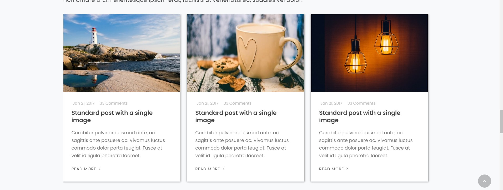

# CSS-Fundamentals-2.0 💻

## Task 🎯

- Shekilde qeyd olunan kartlari ***html&css*** istifade ederek yigmalisiniz.
- Shekilde geyd olunan kartlara ***icon*** elave edin ❗. Icon eleve etmek gaydasini arashdirin. 
- Shekilde geyd olunan kartlara ***shadow***(kölgə) effekti verin❗

